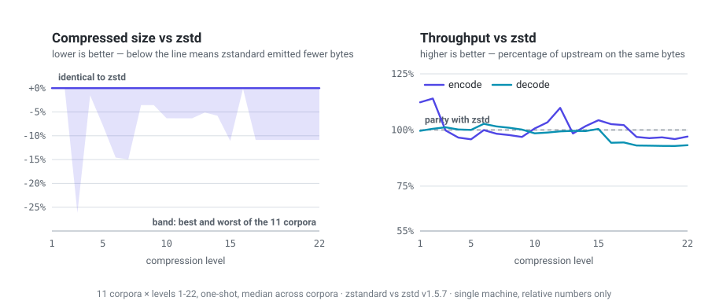
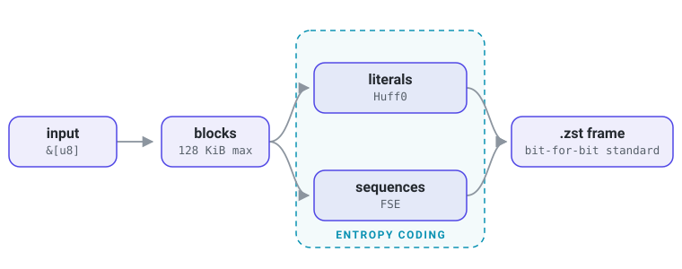

<div align="center">


**A pure Rust Zstandard codec — no C, no build scripts, no toolchain beyond Cargo.**

[](https://github.com/stephenberry/zstandard/actions/workflows/ci.yml)
[](https://github.com/stephenberry/zstandard/actions/workflows/fuzz.yml)
[](https://github.com/stephenberry/zstandard/actions/workflows/miri.yml)
[](#minimum-supported-rust-version)
[](#license)
[](#platform-support)

</div>

`zstandard` is a Zstandard compressor and decompressor written entirely in Rust. Frames it produces are read by the official `zstd`, and frames the official `zstd` produces are read by it. Because there is no C in the build, there is no `cc` invocation, no sysroot to locate, and no cross-compilation toolchain to arrange: `wasm32-unknown-unknown` is just another `--target`.

It is written to be *read*, not just run. The format model is explicit rather than buried behind FFI, every compression level maps onto the same nine parser strategies upstream uses, and a standing benchmark suite measures output size against a pinned upstream revision byte for byte.

This crate is an independent implementation. It is not affiliated with Meta or with the reference `zstd` project, and the Zstandard name is used here to identify the format it implements. See [ATTRIBUTION.md](ATTRIBUTION.md).

## Compared with upstream `zstd`

<div align="center">

</div>

Compressed size is the headline. Across 11 corpora at every level, the median row is byte-identical to upstream, the best is 26% smaller, and the worst is 0.08% larger. Encode is at parity on the median row and its per-level median stays within 5% of upstream at every level; decode sits at 98.5% across every row, easing to about 93% at the top levels. What is left is corpus-specific rather than broad: the dictionary cases run at 0.67-0.82x through levels 4 to 10, and that prefixed-parser band is the largest performance gap still open.

The corpora are generated fixtures, so their absolute compression ratios describe the generator rather than any real workload. What transfers is the comparison, measured on identical bytes against the revision pinned in `upstream-zstd.ref`. Per-level tables, including streaming and dictionary cases, are in [BENCHMARKS.md](BENCHMARKS.md); the chart is generated from it by `python3 scripts/plot_benchmarks.py` and is stamped with the revision it was measured at.

## Quick Start

Add the dependency:

```toml
[dependencies]
zstandard = { git = "https://github.com/stephenberry/zstandard" }
```

Compress and decompress:

```rust
use zstandard::{decode_all, encode_all};

let compressed = encode_all(b"hello zstd")?;
let restored = decode_all(&compressed)?;

assert_eq!(restored, b"hello zstd");
# Ok::<(), zstandard::Error>(())
```

That is the whole surface for the common case. Everything below is opt-in.

## Highlights

| | |
| --- | --- |
| **No C dependency** | Pure Rust, no `cc` crate, no `build.rs`, no vendored sources. Builds anywhere Cargo does. |
| **Interoperable by test** | CI checks both directions against a pinned upstream `zstd` checkout: it decodes upstream output, upstream decodes its output. |
| **Every level** | `1..=22` across all nine upstream parser strategies, plus the negative fast-mode levels, matching upstream's own level table. Individual compression parameters can be overridden directly. |
| **Streaming and one-shot** | Incremental encode/decode with explicit flush, plus `std::io::Read` / `Write` adapters. |
| **Dictionaries** | Raw-content and formatted Zstandard dictionaries, with reusable `EncoderDictionary` and `DecoderDictionary` for hot paths, and training from samples. |
| **Contained `unsafe`** | `#![deny(unsafe_code)]` crate-wide, with individually annotated exceptions confined to the hot loops. |
| **Adversarial input in scope** | Decoder soundness is treated as a security property, with a published threat model, fuzzing, and Miri. |

## How It Works

<div align="center">

</div>

Input is split into blocks. A match finder turns each block into literals and sequences, which are entropy-coded with Huff0 and FSE respectively and assembled into a standard frame. Decoding runs the same path in reverse. Which match finder runs is what the compression level selects, from a single-pass hash table at level 1 to the two-pass optimal parser at level 22.

## Usage

### Compression levels and options

Levels run `-131072..=22`, same as upstream. `CompressionLevel` exposes `FASTEST`, `DEFAULT`, `BETTER`, and `BEST` for the common picks, or use `try_new` for an explicit value. Negative levels are upstream's "fast mode": they trade ratio for speed below what level 1 does, and more negative is faster.

```rust
use zstandard::{decode_all, encode_all_with_options, CompressionLevel, EncoderOptions};

let input = b"compress me";
let compressed = encode_all_with_options(
    input,
    EncoderOptions {
        checksum: true,
        compression_level: CompressionLevel::BETTER,
        ..Default::default()
    },
)?;

assert_eq!(decode_all(&compressed)?, input);
# Ok::<(), zstandard::Error>(())
```

Always construct options with `..Default::default()`. New fields are added in minor releases, and [docs/SEMVER.md](docs/SEMVER.md) treats that as non-breaking.

`EncoderOptions` also carries the frame header switches — `write_content_size` for whether the frame declares its decompressed length, `format` for magicless frames, `pledged_src_size` for telling a stream up front how much it will carry — and `parameters`, described next.

### Overriding compression parameters

`ParameterOverrides` replaces individual parameters that the level would otherwise pick: window and table sizes, search depth, minimum match, target length, and the parser `Strategy`. `None` means "whatever the level chose".

```rust
use zstandard::{decode_all, encode_all_with_options, EncoderOptions, ParameterOverrides, Strategy};

let input = b"a narrower window and a chosen parser";
let compressed = encode_all_with_options(
    input,
    EncoderOptions {
        parameters: ParameterOverrides {
            window_log: Some(20),
            strategy: Some(Strategy::Lazy2),
            ..Default::default()
        },
        ..Default::default()
    },
)?;

assert_eq!(decode_all(&compressed)?, input);
# Ok::<(), zstandard::Error>(())
```

Overrides are fitted to the input the same way a level's own parameters are, so asking for a window larger than the source still yields the smaller one. Each parameter's accepted range is a `ParameterBounds` constant on `ParameterOverrides` — `WINDOW_LOG`, `HASH_LOG`, and so on — and a value outside it is reported rather than clamped.

Three of the fields are three-state switches rather than values, each defaulting to the `Auto` that reproduces what the level would have done on its own: `long_distance_matching`, `use_row_match_finder`, and `literal_compression`. `Auto` is not a third behaviour but a rule read off the resolved parameters, so forcing one can reach a configuration no level selects — `LiteralCompressionMode::Enabled` Huffman-codes literals under a negative level, where the rule would have stored them verbatim.

### Streaming

Push input as it arrives and drain output as it is produced. Neither side has to know the total size up front.

```rust
use zstandard::{DecoderOptions, EncoderOptions, StreamingDecoder, StreamingEncoder};

let input = b"streaming example data".repeat(10_000);

let mut encoder = StreamingEncoder::new(EncoderOptions {
    block_size: 64 * 1024,
    checksum: true,
    ..Default::default()
})?;

let mut compressed = encoder.take_output();
for chunk in input.chunks(9_001) {
    encoder.push(chunk)?;
    compressed.extend_from_slice(&encoder.take_output());
}
encoder.finish()?;
compressed.extend_from_slice(&encoder.take_output());

let mut decoder = StreamingDecoder::new(DecoderOptions::default());
let mut restored = Vec::new();
for chunk in compressed.chunks(113) {
    decoder.push(chunk)?;
    restored.extend_from_slice(&decoder.take_output());
}
decoder.finish()?;
restored.extend_from_slice(&decoder.take_output());

assert_eq!(restored, input);
# Ok::<(), zstandard::Error>(())
```

Call `flush()` to force buffered input out before the frame ends — useful for interactive protocols, at some cost in ratio. Call `reset()` after `finish()` to encode another frame with the same configuration and the same allocations.

`take_output()` hands over the encoder's buffer, so the next block grows a fresh one. A pump that drains every block into somewhere else should use `read()` instead, which copies into a buffer you own and leaves the encoder's capacity in place — upstream's `ZSTD_outBuffer` shape, and allocation-free once warm:

```rust
use zstandard::{EncoderOptions, StreamingEncoder, decode_all};

let input = b"drained into a buffer the caller owns".repeat(2_000);

let mut encoder = StreamingEncoder::new(EncoderOptions::default())?;
let mut window = vec![0u8; StreamingEncoder::RECOMMENDED_OUTPUT_SIZE];
let mut compressed = Vec::new();

for chunk in input.chunks(StreamingEncoder::RECOMMENDED_INPUT_SIZE) {
    encoder.push(chunk)?;
    loop {
        let produced = encoder.read(&mut window);
        if produced == 0 { break; }
        compressed.extend_from_slice(&window[..produced]);
    }
}
encoder.finish()?;
loop {
    let produced = encoder.read(&mut window);
    if produced == 0 { break; }
    compressed.extend_from_slice(&window[..produced]);
}

assert_eq!(decode_all(&compressed)?, input);
# Ok::<(), zstandard::Error>(())
```

`pending_output()` and `consume_output()` are the same thing without the copy, for forwarding a slice straight on. `RECOMMENDED_INPUT_SIZE` and `RECOMMENDED_OUTPUT_SIZE` exist on both streaming types and are upstream's `ZSTD_CStreamInSize` and friends: sizes at which no call is ever the reason progress stops.

### `std::io` adapters

For dropping the codec into an existing pipeline:

```rust
use std::io::{Read, Write};
use zstandard::io::{Reader, Writer};

let payload = b"io adapters make this composable".repeat(500);

let mut writer = Writer::new(Vec::new())?;
writer.write_all(&payload)?;
let compressed = writer.finish()?;

let mut restored = Vec::new();
Reader::new(&compressed[..]).read_to_end(&mut restored)?;

assert_eq!(restored, payload);
# Ok::<(), std::io::Error>(())
```

`Writer::finish()` ends the frame and hands back the inner writer. Dropping a `Writer` without calling it leaves the frame truncated, because `Drop` has nowhere to report an error.

### Dictionaries

Small, similar payloads compress far better with a shared dictionary. Both raw-content dictionaries and formatted Zstandard dictionaries work:

```rust
use zstandard::{decode_all_with_dict, encode_all_with_dict};

let dictionary = b"shared prefix dictionary";
let payload = b"shared prefix dictionary + payload";

let compressed = encode_all_with_dict(payload, dictionary)?;
let restored = decode_all_with_dict(&compressed, dictionary)?;

assert_eq!(restored, payload);
# Ok::<(), zstandard::Error>(())
```

When the same dictionary is used repeatedly, parse it once and pass it to the `*_with_prepared_dict` entry points to skip the per-call setup. `EncoderOptions::write_dict_id` controls whether the frame header records the dictionary ID or deliberately omits it.

The two directions are separate types, `EncoderDictionary` and `DecoderDictionary`, because they need different tables built from the same bytes: a formatted dictionary's encoding tables are 11 KiB and its decoding tables are 22.5 KiB, and neither side should carry the other's. Upstream draws the same line as `ZSTD_CDict` and `ZSTD_DDict`. To use one dictionary in both directions, build both over the same `Arc<[u8]>`, which stores the content once:

```rust
use std::sync::Arc;
use zstandard::{DecoderDictionary, EncoderDictionary, decode_all_with_prepared_dict, encode_all_with_prepared_dict};

# fn main() -> zstandard::Result<()> {
let bytes: Arc<[u8]> = Arc::from(b"shared dictionary content".as_slice());
let encoding = EncoderDictionary::from_shared(Arc::clone(&bytes))?;
let decoding = DecoderDictionary::from_shared(bytes)?;

let frame = encode_all_with_prepared_dict(b"dictionary content here", &encoding)?;
assert_eq!(decode_all_with_prepared_dict(&frame, &decoding)?, b"dictionary content here");
# Ok(())
# }
```

Parsing a dictionary reads its entropy tables but does not index its content for matching, and indexing is the larger of the two. That happens on first use, since its size depends on the compression parameters, and is cached from then on — so by default the first compression pays for every later one. `EncoderDictionary::prepare` does it in advance instead, upstream's `ZSTD_createCDict`:

```rust
use zstandard::{CompressionLevel, EncoderDictionary, EncoderOptions};

# fn main() -> zstandard::Result<()> {
# let dictionary_bytes = b"shared dictionary content".to_vec();
let dictionary = EncoderDictionary::from_shared(dictionary_bytes)?;
let options = EncoderOptions {
    compression_level: CompressionLevel::BETTER,
    ..Default::default()
};

// Pay for the tables at startup rather than inside the first request.
dictionary.prepare(options);
# Ok(())
# }
```

One call covers every input size at those options; a level that resolves to different table geometry wants its own. Skipping it changes nothing but when the cost lands.

A dictionary can also be trained from sample data, the equivalent of upstream's `ZDICT_trainFromBuffer`:

```rust
use zstandard::{EncoderDictionary, encode_all_with_prepared_dict, train_dictionary};

# fn main() -> zstandard::Result<()> {
# let records: Vec<Vec<u8>> = (0..64)
#     .map(|i| format!("{{\"id\":{i},\"status\":\"open\",\"path\":\"/v2/objects\"}}").into_bytes())
#     .collect();
let samples: Vec<&[u8]> = records.iter().map(Vec::as_slice).collect();
let dictionary = train_dictionary(&samples, 1024)?;

let prepared = EncoderDictionary::new(&dictionary)?;
let compressed = encode_all_with_prepared_dict(&records[0], &prepared)?;
# assert!(compressed.len() < records[0].len());
# Ok(())
# }
```

Training wants many samples: upstream advises a corpus at least ten times the dictionary size, preferably a hundred times. Seven samples is the hard floor — five have to land in the training split and at least one in the split held back for measurement — and seven will not produce anything worth using. `train_dictionary_with_parameters` exposes the underlying fastCover controls (`k`, `d`, `f`, `accel`, `steps`, split point) and lets the dictionary ID be set explicitly. Trained dictionaries are not byte-identical to upstream's — the trainer measures candidates with this crate's encoder, so it can settle on a different segment size — but they land within about a percent of upstream's on held-out samples, which the interop suite measures.

### Working without allocating

`encode_into_slice` writes into a caller-owned buffer, sized with `compress_bound`:

```rust
use zstandard::{compress_bound, decode_all, encode_into_slice, EncoderOptions};

let input = b"no allocation on the encode path";
let options = EncoderOptions::default();

let mut buffer = vec![0u8; compress_bound(input.len(), options)];
let written = encode_into_slice(input, &mut buffer, options)?;

assert_eq!(decode_all(&buffer[..written])?, input);
# Ok::<(), zstandard::Error>(())
```

`decode_into_slice` is the mirror, and the shape `ZSTD_decompress` has. Size the destination with `decompressed_size` when the frames declare it or `decompress_bound` when they may not; exactly the decompressed size is enough, with no padding requirement:

```rust
use zstandard::{decode_into_slice, decompressed_size, encode_all};

let compressed = encode_all(b"no allocation on the decode path either")?;
let size = decompressed_size(&compressed)?.expect("this encoder declares it");

let mut dst = vec![0u8; size as usize];
let written = decode_into_slice(&compressed, &mut dst)?;

assert_eq!(&dst[..written], b"no allocation on the decode path either");
# Ok::<(), zstandard::Error>(())
```

The reusable `Encoder` and `Decoder` contexts go further, holding their scratch buffers across calls so a hot loop stops paying for entropy-coder setup every time. A warm `Decoder` writing into a slice makes no allocations at all.

### Frame utilities

```rust
use zstandard::{encode_all, parse_frame_header, write_skippable_frame, FrameHeader};

let compressed = encode_all(b"payload")?;
let header = parse_frame_header(&compressed)?;
assert!(matches!(header, FrameHeader::Zstandard(_)));

let metadata = write_skippable_frame(3, b"app-metadata")?;
assert!(!metadata.is_empty());
# Ok::<(), zstandard::Error>(())
```

Three more answer sizing questions without decoding, by walking block headers:

```rust
use zstandard::{decompress_bound, decompressed_size, encode_all, find_frame_compressed_size};

let mut stream = encode_all(b"first frame")?;
let first_len = stream.len();
stream.extend_from_slice(&encode_all(b"second frame")?);

// Where does frame one end, so it can be handed on alone?
assert_eq!(find_frame_compressed_size(&stream)?, first_len);
// What do the frames say they decode to? `None` if any did not say.
assert_eq!(decompressed_size(&stream)?, Some(23));
// What is the most they could decode to? Always answers.
assert_eq!(decompress_bound(&stream)?, 23);
# Ok::<(), zstandard::Error>(())
```

Both sizes come from the input's own headers, so for untrusted input they are the attacker's to choose. Cap what a decode may produce with `DecoderOptions::max_output_size` rather than trusting either number.

## API Overview

The public surface is deliberately small while the internals evolve. Each row lists the base entry point; every one has `_with_options`, `_with_dict`, and `_with_prepared_dict` variants where they make sense.

| Task | Entry points |
| --- | --- |
| One-shot | `encode_all`, `decode_all`, `encode_into_slice`, `decode_into_slice`, `compress_bound` |
| Reusable contexts | `Encoder`, `Decoder` |
| Streaming | `StreamingEncoder` (`push`, `read`, `take_output`, `flush`, `finish`, `reset`), `StreamingDecoder` |
| `std::io` | `io::Writer`, `io::Reader` |
| Dictionaries | `EncoderDictionary::new`, `DecoderDictionary::new`, the `*_with_dict` and `*_with_prepared_dict` families |
| Dictionary training | `train_dictionary`, `train_dictionary_with_parameters` |
| Configuration | `CompressionLevel`, `EncoderOptions`, `DecoderOptions`, `ParameterOverrides`, `ParameterBounds`, `Strategy`, `Format` |
| Frame inspection | `parse_frame_header`, `parse_frame_header_with_format`, `parse_block_header`, `write_skippable_frame` |
| Frame sizing | `find_frame_compressed_size`, `decompress_bound`, `decompressed_size`, each with a `_with_format` variant |
| Errors | `Error`, `Result` |

Run `cargo doc --open` for the full signatures and per-item documentation.

`DecoderOptions` also carries an opt-in strict mode that requires the input to be exactly one frame, for payloads carried inside another protocol where trailing bytes should be an error rather than a hint.

## Status

**Implemented today**

- one-shot and streaming compression and decompression, with explicit streaming flush
- reusable encoder, decoder, and streaming contexts via `reset()`
- raw, RLE, and compressed blocks; Huff0 literals, treeless literals, and full FSE sequence encode and decode
- concatenated frames, skippable frames, content-size validation, and content checksums
- an opt-in strict decode mode that rejects anything beyond a single frame
- raw-content and formatted dictionaries, split into `EncoderDictionary` and `DecoderDictionary` as upstream splits `ZSTD_CDict` and `ZSTD_DDict`, with configurable dictionary-ID emission; `new` borrows the bytes and `from_shared` takes ownership of them, giving a `'static`, `Send + Sync` dictionary that can live in a struct or move between threads, and `EncoderDictionary::prepare` builds the match-state tables up front as `ZSTD_createCDict` does
- dictionary training from samples, the equivalent of upstream's `ZDICT_trainFromBuffer`
- compression levels `1..=22` across all nine upstream parser strategies: fast, double-fast, greedy, lazy, lazy2, btlazy2, btopt, btultra, and btultra2, plus the negative "fast mode" levels down to `-131072`
- long-distance matching across every parser strategy, via `ParameterOverrides::long_distance_matching` and the four `ldm_*` table parameters
- rolling match state and entropy scratch reused across blocks rather than rebuilt per block
- allocation-free encoding and decoding into a caller-owned `&mut [u8]`, and allocation-free draining of streamed output into one (`StreamingEncoder::read`), so a warm `io::Writer` allocates nothing per block and a warm `Decoder` writing into a slice allocates nothing at all
- frame sizing without decoding: `find_frame_compressed_size`, `decompress_bound`, `decompressed_size`
- frame and block header parsing helpers, and `std::io::Read` / `Write` adapters
- upstream interoperability tests and standing Rust-versus-upstream benchmarks

**Not finished yet**

- multithreaded compression and seekable framing
- a broader advanced parameter surface: fourteen of upstream's `ZSTD_c_*` knobs are exposed. Both block splitters run on the same rules upstream applies by default, but neither is settable (`ZSTD_c_splitAfterSequences`, `ZSTD_c_blockSplitterLevel`), and target block size (`ZSTD_c_targetCBlockSize`) is not implemented at all
- `LdmMode::Auto`, which would enable long-distance matching implicitly at the levels upstream does; the rule is implemented and verified against C, but nothing consults it yet

## Interoperability and Benchmarks

Compatibility is measured, not asserted. The interop suite builds a small helper against a pinned upstream checkout (the revision in `upstream-zstd.ref`) and verifies that Rust decodes upstream output, upstream decodes Rust output, and that dictionaries, checksums, levels, concatenated frames, and malformed-input behavior all stay aligned.

Compression *ratio* is held to the same standard: [BENCHMARKS.md](BENCHMARKS.md) records exact byte counts for both implementations across eleven corpora and every level, one-shot and streaming, alongside throughput. Numbers are only meaningful against the pinned revision, since upstream changes its level mapping and heuristics between releases.

```sh
cargo bench --bench interop            # size and throughput vs upstream
cargo bench --bench interop -- --quick # faster smoke run

cargo run --release --features internal-trace --bin benchmark_report -- --output BENCHMARKS.md
```

## Safety

`unsafe` is used, and contained. The crate root is `#![deny(unsafe_code)]`, and every use is an individually annotated `#[allow(unsafe_code)]` — currently 145 in shipping code, all inside the entropy coders (`src/entropy/`), the match finders (`src/window/`), the sequence execution loop (`src/sequence.rs`), and the decoder's output destination (`src/decode_out.rs`), where they buy unchecked indexing and wide copies on the hot paths. One more lives in the off-by-default `asm-inspect` maintainer tool. Nothing in the frame, block, or dictionary layer uses `unsafe` at all.

Decoder soundness on adversarial input is treated as a security property. [docs/THREAT_MODEL.md](docs/THREAT_MODEL.md) records what the decoder guarantees and what is out of scope. Please report suspected vulnerabilities privately as described in [SECURITY.md](SECURITY.md) rather than opening a public issue.

## Platform Support

The library needs `std`; `no_std` is not supported. `wasm32-unknown-unknown` is a first-class target, checked in CI with `cargo check --lib` for both feature sets so that it stays true rather than being true by accident.

## Minimum Supported Rust Version

`zstandard` requires **Rust 1.96** or later (2024 edition). The MSRV is part of the public API: raising it takes a minor-version release while the crate is `0.x`, and a major-version release after `1.0`. Versioning and breaking-change policy are in [docs/SEMVER.md](docs/SEMVER.md).

## Development

```sh
cargo test                              # full suite
cargo test --features internal-trace    # adds the upstream-parity suite
cargo fuzz run full_decode              # requires cargo-fuzz
```

The test suite covers pure Rust roundtrips, malformed headers, blocks, checksums, literals and sequences, dictionary and streaming behavior, and optional upstream interop. Fuzz targets live under `fuzz/` (`frame_parse`, `literals_parse`, `sequence_parse`, `full_decode`, `streaming_decode`, plus encode round-trip targets) and run in CI alongside Miri.

[CONTRIBUTING.md](CONTRIBUTING.md) has the full setup, test, fuzz, and benchmark instructions; [CODE_OF_CONDUCT.md](CODE_OF_CONDUCT.md) covers community expectations. Released changes are in [CHANGELOG.md](CHANGELOG.md). Development history from before the first release is in [dev/PRERELEASE_LOG.md](dev/PRERELEASE_LOG.md).

Contributions are welcome.

## License

Licensed under either of

- MIT License ([LICENSE-MIT](LICENSE-MIT))
- Apache License, Version 2.0 ([LICENSE-APACHE](LICENSE-APACHE))

at your option, which is the customary pairing for Rust crates and carries Apache-2.0's explicit patent grant. Unless you explicitly state otherwise, any contribution intentionally submitted for inclusion in the work shall be dual licensed as above, without any additional terms or conditions.

This is an independent implementation rather than a binding, but it is written against the reference library, and upstream's notice travels with this source in [ATTRIBUTION.md](ATTRIBUTION.md).
